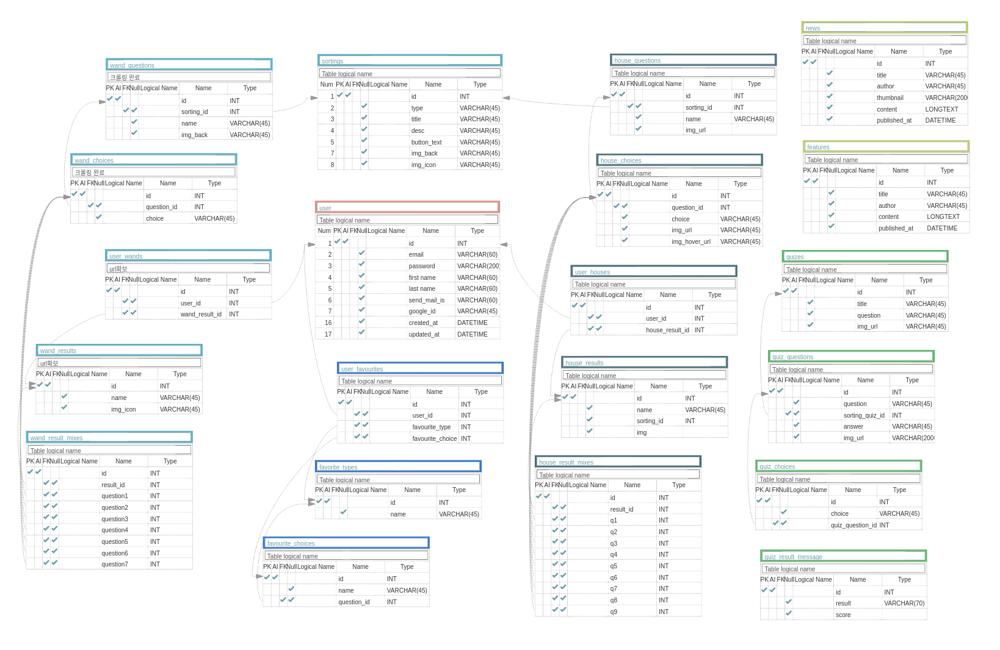

# Introduction

[해리포터 팬사이트](https://www.wizardingworld.com) 클론 프로젝트
- 기간    : 2020.03.09 - 2020.03.20
- 팀 구성 : 프론트엔드 3명, 백엔드 2명 (총 5명)
- [wezard-frontend Repository](https://github.com/wecode-bootcamp-korea/wezard-frontend)

&nbsp;
&nbsp;
&nbsp;

# DB Modeling

&nbsp;
&nbsp;
&nbsp;
# Technologies
- Python
- Django Web Framework
- MySQL
- AWS EC2, RDS
- Docker
- CORS headers

&nbsp;
&nbsp;
&nbsp;
# Features
## Data
- 크롤링(BeautifulSoup, Selenium)

## User
- 회원가입, 로그인(Bcrypt, JWT)
- 소셜로그인(Google)

## Sorting
- 기숙사 배정하기(심리테스트 형식)
- 기숙사 결과보기 및 저장하기

## Article
- news/feature 목록 및 상세보기
- quiz 퀴즈 풀기 및 정답률에 따른 결과 보여주기

# Demo

[유투브 영상](https://youtu.be/Ly-o9a1oEkg)
